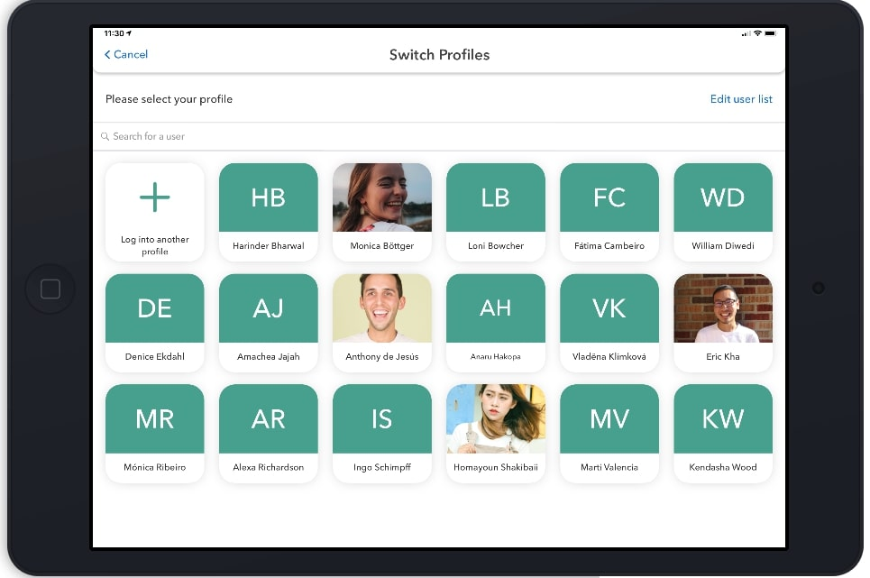
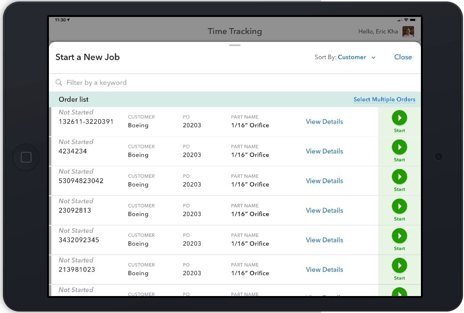
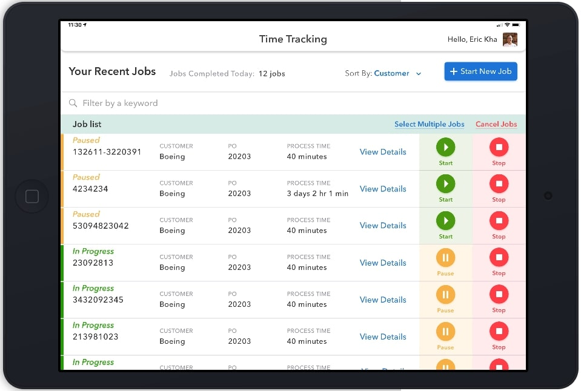
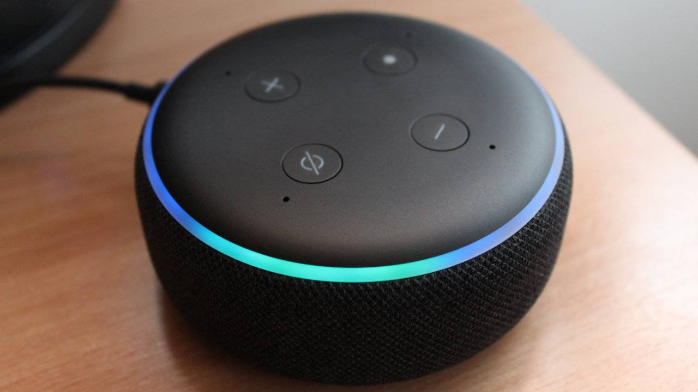

## Sponsored by [Xemelgo](https://www.xemelgo.com/ "xemelgo website")

# What is time tracking?
Time Tracking is a mobile app that monitors the time it takes for work orders to be completed by manufacturing plant operators. As soon as a work order is generated, operators can select it and start timing how long it takes for a task to be completed in a work order.

# What are the benefits?
By knowing how long each task takes in a work order, manufactures get better insights into their processes. They can give accurate estimated timed deliveries, find anomalies in their workflow processes and charge the right price for their services.

# Track your entire plant right at your fingertips
Manange your work orders in three easy steps.
## Pick your profile

## Pick a work order

## Start time tracking 

Try out our demo [here](https://projects.invisionapp.com/share/9YWTVMLAKZ3#/screens "app demo").

# Voice Solutions

Through voice devices like Alexa, a user can start, pause, and complete work orders with the ease of just using their voice. [Try](https://creator.voiceflow.com/demo/3318901323958412 "Voice flow demo")
 out our demo today!

# Contact us
Anant Rajeev: anantr@uw.edu

Ali Rafiq: aliar97@uw.edu

Ansul Sinha: ansuls@uw.edu

Amogh Dave: amogh@uw.edu